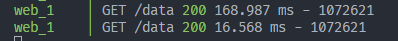

# redis-express

A simple example of using Redis to cache data from an Express server.

Cache hit result:

## Tech Stack

- Express
- MongoDB
- Redis
- Mock data from [Mockaroo](https://mockaroo.com/)

## Development Guide

For development:

- Run express server locally: `npm run dev`
- Run redis and express in docker containers: `docker-compose -f docker-compose.dev.yml up`

For production:

- Run all three in docker containers: `docker-compose up`

## API

See [request.rest](request.rest)
